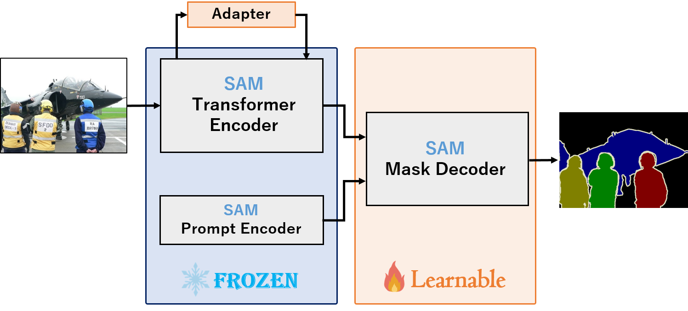

# FT-SAM
This repo is the implementation for Fine Tuning Segment Anything Model.
<div align="center">
  
</div>


## Installation
Following [Segment Anything](https://github.com/facebookresearch/segment-anything), `python=3.8.16`, `pytorch=1.8.0`, and `torchvision=0.9.0` are used in FT-SAM.
1. Clone this repository.
   ```
   git clone https://github.com/usagisukisuki/FT-SAM.git
   cd FT-SAM
   ```
2. Install Pytorch and TorchVision. (you can follow the instructions here)
3. Install other dependencies.
   ```
   pip install -r requirements.txt
   ```

## Checkpoints
We use checkpoint of SAM in [vit_b](https://github.com/facebookresearch/segment-anything) version.
Additionally, we also use checkpoint of MobileSAM.
Please download from [SAM](https://github.com/facebookresearch/segment-anything) and [MobileSAM](https://github.com/ChaoningZhang/MobileSAM), and extract them under "models/Pretrained_model".
```
models
├── Pretrained_model
    ├── sam_vit_b_01ec64.pth
    ├── mobile_sam.pt
```

## Dataset
We can evaluate two biological segmentation datasets: ISBI2012 (2 class) and ssTEM (5 class).
Please download from [[FT-SAM]](https://drive.google.com/drive/folders/1oyzCByA2H64IF2Hlp643cceDk9jMr4u9?usp=drive_link) and extract them under "Dataset", and make them look like this:
```
Dataset
├── ISBI2012
    ├── Image
        ├── train_volume00
        ├── train_volume01
        ├── ...
    ├── Label

├── ssTEM
    ├── data
    ├── ...

```

## Fine tuning on SAM

### Binary segmentation (ISBI2012)
If you prepared the dataset, you can directly run the following code to train the model with single GPU.
```
python3 train.py --gpu 0 --dataset 'ISBI2012' --out result_sam --modelname 'SAM' --batchsize 8
```
If you use multi GPUs, you can directly run the following code.
```
CUDA_VISIBLE_DEVICES=0,1 python3 train.py --dataset 'ISBI2012' --out result_sam --modelname 'SAM' --batchsize 8 --multi
```

### Multi-class segmentation (ssTEM)
If you prepared the dataset, you can directly run the following code to train the model with single GPU.
```
python3 train.py --gpu 0 --dataset 'ssTEM' --out result_sam --modelname 'SAM' --batchsize 8 --num_classes=5 --multimask_output=True
```

## Fine tuning on SAM with Anything


### Fine tuning on SAM with LoRA
LoRA: Low-Rank Adaptation [[paper]](https://arxiv.org/abs/2106.09685)

```
python3 train.py --gpu 0 --dataset 'ISBI2012' --modelname 'SAM_LoRA' 
```

### Fine tuning on SAM with ConvLoRA
Convolution Meets LoRA: Parameter Efficient Finetuning for Segment Anything Model [[paper]](https://arxiv.org/abs/2401.17868)

```
python3 train.py --gpu 0 --dataset 'ISBI2012' --modelname 'SAM_ConvLoRA'
```

### Fine tuning on SAM with AdaptFormer
AdaptFormer: Adapting Vision Transformers for Scalable Visual Recognition [[paper]](https://arxiv.org/abs/2205.13535)

```
python3 train.py --gpu 0 --dataset 'ISBI2012' --modelname 'SAM_AdaptFormer'
```

### Fine tuning on MobileSAM
#### MobileSAM: FASTER SEGMENT ANYTHING: TOWARDS LIGHTWEIGHT SAM FOR MOBILE APPLICATIONS [[paper]](https://arxiv.org/abs/2306.14289)

```
python3 train.py --gpu 0 --dataset 'ISBI2012' --modelname 'MobileSAM'
```

### Fine tuning on MobileSAM with AdaptFormer
```
 python3 train.py --gpu 0 --dataset 'ISBI2012' --modelname 'MobileSAM_AdaptFormer'
```

### Fine tuning on SAMUS
SAMUS: Adapting Segment Anything Model for Clinically-Friendly and Generalizable Ultrasound Image Segmentation [[paper]](https://arxiv.org/abs/2309.06824)
```
python3 train.py --gpu 0 --dataset 'ISBI2012' --modelname 'SAMUS'
```


## Testing


